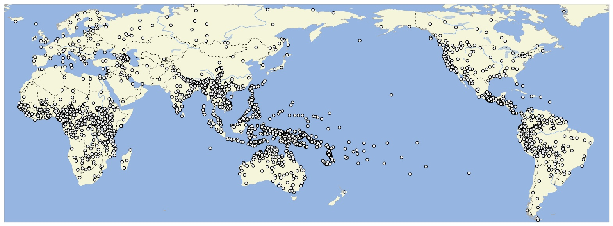

# Grambank v1.0

## How to cite

If you use these data please cite
- the original source
  > Skirgård, Hedvig and Haynie, Hannah J. and Blasi, Damián E. and Hammarström, Harald and Collins, Jeremy and Latarche, Jay J. and Lesage, Jakob and Weber, Tobias and Witzlack-Makarevich, Alena and Passmore, Sam and Chira, Angela and Maurits, Luke and Dinnage, Russell and Dunn, Michael and Reesink, Ger and Singer, Ruth and Bowern, Claire and Epps, Patience and Hill, Jane and Vesakoski, Outi and Robbeets, Martine and Abbas, Noor Karolin and Auer, Daniel and Bakker, Nancy A. and Barbos, Giulia and Borges, Robert D. and Danielsen, Swintha and Dorenbusch, Luise and Dorn, Ella and Elliott, John and Falcone, Giada and Fischer, Jana and Ghanggo Ate, Yustinus and Gibson, Hannah and Göbel, Hans-Philipp and Goodall, Jemima A. and Gruner, Victoria and Harvey, Andrew and Hayes, Rebekah and Heer, Leonard and Herrera Miranda, Roberto E. and Hübler, Nataliia and Huntington-Rainey, Biu and Ivani, Jessica K. and Johns, Marilen and Just, Erika and Kashima, Eri and Kipf, Carolina and Klingenberg, Janina V. and König, Nikita and Koti, Aikaterina and Kowalik, Richard G. A. and Krasnoukhova, Olga and Lindvall, Nora L.M. and Lorenzen, Mandy and Lutzenberger, Hannah and Martins, Tônia R.A. and Mata German, Celia and van der  Meer, Suzanne and Montoya Samamé, Jaime and Müller, Michael and Muradoglu, Saliha and Neely, Kelsey and Nickel, Johanna and Norvik, Miina and Oluoch, Cheryl Akinyi and Peacock, Jesse and Pearey, India O.C. and Peck, Naomi and Petit, Stephanie and Pieper, Sören and Poblete, Mariana and Prestipino, Daniel and Raabe, Linda and Raja, Amna and Reimringer, Janis and Rey, Sydney C. and Rizaew, Julia and Ruppert, Eloisa and Salmon, Kim K. and Sammet, Jill and Schembri, Rhiannon and Schlabbach, Lars and Schmidt, Frederick W.P. and Skilton, Amalia and Smith, Wikaliler Daniel and de  Sousa, Hilário and Sverredal, Kristin and Valle, Daniel and Vera, Javier and Voß, Judith and Witte, Tim and Wu, Henry and Yam, Stephanie and Ye 葉婧婷, Jingting and Yong, Maisie and Yuditha, Tessa and Zariquiey, Roberto and Forkel, Robert and Evans, Nicholas and Levinson, Stephen C. and Haspelmath, Martin and Greenhill, Simon J. and Atkinson, Quentin D. and Gray, Russell D. (in press). Grambank reveals the importance of genealogical constraints on linguistic diversity and highlights the impact of language loss. Science Advances.
- the derived dataset using the DOI of the [particular released version](../../releases/) you were using

## Description

Global dataset of structural linguistic features, part of Glottobank.

This dataset is licensed under a CC-BY-4.0 license

Available online at https://grambank.clld.org

For examples on how to use this datasets, refer to the
[`recipes` folder in this repository](./recipes/).

## CLDF Datasets

The following CLDF datasets are available in [cldf](cldf):

- CLDF [StructureDataset](https://github.com/cldf/cldf/tree/master/modules/StructureDataset) at [cldf/StructureDataset-metadata.json](cldf/StructureDataset-metadata.json)