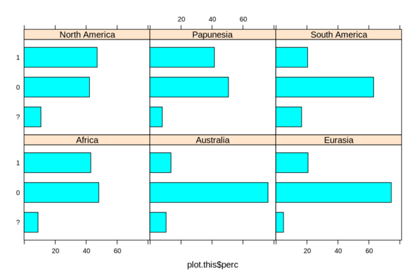

# Accessing Grambank data

The [Grambank](http://grambank.clld.org) data is archived with [ZENODO](https://zenodo.org) as CLDF structure dataset.
Below we describe methods to access this data from various computing environments. For all methods we assume an
unzipped download of the CLDF dataset to be available on a local disk, i.e. a directory `Grambank` with the following contents:
- `StructureDataset-metadata.json`: The machine readable description of the dataset
- `values.csv`: The main data file, containing all codings
- `languages.csv`
- `parameters.csv`
- `codes.csv`
- `sources.bib`


These files can be accessed in various ways:
- [Using off-the-shelf CSV tools](#csvkit)
- [`pycldf`](#pycldf)
- [SQLite](#sqlite)
- [R](#r)


<a id="csvkit"> </a>
## Using off-the-shelf CSV tools

A CLDF dataset is - basically - just a set of CSV files. Thus, it can be accessed using off-the-shelf
tools to handle CSV data (e.g. spreadsheet processors). One such tool which can be particularly useful as
"pre-processor" for CLDF data is [`csvkit`](https://csvkit.readthedocs.io/). In particular the 
[`csvjoin`](https://csvkit.readthedocs.io/en/1.0.2/scripts/csvjoin.html) command, installed with `csvkit` can
be used to merge the data from the various constituent CSV files of a CLDF dataset into a single file for
easier processing, e.g. in statistical analysis tools like [R](https://www.r-project.org/) or [Pandas](http://pandas.pydata.org/).

The typical usage with the Grambank data - a [CLDF structure dataset](https://github.com/glottobank/cldf/tree/master/modules/StructureDataset) - looks as follows:
1. We join the language metadata to each value row
2. then join the feature metadata
3. and finally pipe the result to a new CSV file.

```bash
$ csvjoin -y 0 -c Language_ID,ID values.csv languages.csv \
| csvjoin -y 0 -c Parameter_ID,ID - parameters.csv > grambank.csv
```

The merged file can then be inspected, e.g. using `csvstat` (although this may max out the resources of
some machines):
```bash
$ csvstat -y 0 grambank.csv 
  1. "ID"

        Type of data:          Text
        Contains null values:  False
        Unique values:         441663
        ...
  2. "Language_ID"

        Type of data:          Text
        Contains null values:  False
        Unique values:         2467
        Longest value:         8, characters
        Most common values:    abad1241 (195x)
        ...
  3. "Parameter_ID"

        Type of data:          Text
        Contains null values:  False
        Unique values:         195
        Longest value:         5, characters
        Most common values:    GB028 (2451x)
        ...
  4. "Value"

        Type of data:          Text
        Contains null values:  False
        Unique values:         5
        Longest value:         1, characters
        Most common values:    0 (242782x)
                               1 (112315x)
                               ? (79638x)
                               2 (5410x)
                               3 (1518x)

  5. "Code_ID"

        Type of data:          Text
        Contains null values:  True (excluded from calculations)
        Unique values:         399
        Longest value:         7, characters
        Most common values:    None (79638x)
                               GB197-0 (2143x)
                               GB165-0 (2125x)
                               GB043-0 (2117x)
                               GB166-0 (2090x)

  6. "Comment"

        Type of data:          Text
        Contains null values:  True (excluded from calculations)
        Unique values:         46658
        Longest value:         15.925, characters
        ...
  7. "Source"

        Type of data:          Text
        Contains null values:  True (excluded from calculations)
        Unique values:         118282
        Longest value:         485, characters
        ...
  ...
 10. "Name"
        Type of data:          Text
        Contains null values:  False
        Unique values:         2467
        Longest value:         49, characters
        Most common values:    Abadi (195x)
                               Mungbam (195x)
                               Abé (195x)
                               Abenlen Ayta (195x)
                               Abipon (195x)

 11. "Macroarea"

        Type of data:          Text
        Contains null values:  True (excluded from calculations)
        Unique values:         7
        Longest value:         13, characters
        Most common values:    Papunesia (131279x)
                               Eurasia (106336x)
                               Africa (98377x)
                               North America (46153x)
                               South America (37642x)

 12. "Latitude"

        Type of data:          Number
        Contains null values:  True (excluded from calculations)
        Unique values:         2427
        Smallest value:        -55,275
        Largest value:         73,135
        Sum:                   3.818.882,19
        Mean:                  8,649
        Median:                6,406
        StDev:                 20,389
        Most common values:    26,91 (780x)
                               41, (585x)
                               12,706 (585x)
                               40, (585x)
                               70,669 (564x)

 13. "Longitude"

        Type of data:          Number
        Contains null values:  True (excluded from calculations)
        Unique values:         2432
        Smallest value:        -178,137
        Largest value:         179,198
        Sum:                   23.806.340,186
        Mean:                  53,915
        Median:                81,36
        StDev:                 86,854
        Most common values:    98,94 (780x)
                               79,952 (585x)
                               130,914 (564x)
                               94,689 (564x)
                               125,499 (390x)

 14. "Glottocode"

        Type of data:          Text
        Contains null values:  False
        Unique values:         2467
        Longest value:         8, characters
        Most common values:    abad1241 (195x)
                               abar1238 (195x)
                               abee1242 (195x)
                               aben1249 (195x)
                               abip1241 (195x)
 ...
 17. "Family_name"

        Type of data:          Text
        Contains null values:  True (excluded from calculations)
        Unique values:         216
        Longest value:         24, characters
        Most common values:    Austronesian (99805x)
                               Atlantic-Congo (56719x)
                               Sino-Tibetan (37924x)
                               Afro-Asiatic (21105x)
                               None (18223x)

 18. "Family_level_ID"

        Type of data:          Text
        Contains null values:  True (excluded from calculations)
        Unique values:         216
        Longest value:         8, characters
        Most common values:    aust1307 (99805x)
                               atla1278 (56719x)
                               sino1245 (37924x)
                               afro1255 (21105x)
                               None (18223x)

 19. "Language_level_ID"

        Type of data:          Text
        Contains null values:  False
        Unique values:         2430
        Longest value:         8, characters
        Most common values:    ngar1284 (1170x)
                               lisu1250 (780x)
                               miya1259 (756x)
                               irul1243 (585x)
                               even1260 (564x)

 20. "level"

        Type of data:          Text
        Contains null values:  False
        Unique values:         3
        Longest value:         8, characters
        Most common values:    language (428872x)
                               dialect (12682x)
                               family (109x)
 ...

Row count: 441663
```

<a id="pycldf"> </a>
## Using `pycldf` programmatically from Python scripts

The script [`values_per_area.py`](values_per_area.py) gives an example how the [`pycldf` package](https://github.com/glottobank/pycldf)
can be used to read the Grambank data from within a Python program.


### Requirements

To run the script, you need 
- Python 3.7+
- with `pycldf>=1.0`
- an unzipped local download of the Grambank CLDF data.


### Usage

The script requires two arguments:
- the path to the JSON metadata file of the CLDF dataset
- a Grambank feature ID

```bash
$ python values_per_area.py StructureDataset-metadata.json GB020

GB020: Are there definite or specific articles?

Africa
  Not known: 8.86%
  absent: 48.15%
  present: 42.99%
Australia
  Not known: 10.32%
  absent: 76.19%
  present: 13.49%
Eurasia
  Not known: 4.81%
  absent: 74.51%
  present: 20.68%
North America
  Not known: 10.74%
  absent: 42.15%
  present: 47.11%
Papunesia
  Not known: 7.86%
  absent: 50.62%
  present: 41.52%
South America
  Not known: 16.50%
  absent: 63.11%
  present: 20.39%
```

<a id="sqlite"> </a>
## Accessing Grambank data in SQLite

The `pycldf` package comes with a command to load a CLDF dataset into a SQLite database,
facilitating further analysis and manipulation via SQL:

```bash
$ time cldf createdb StructureDataset-metadata.json grambank.sqlite
INFO    <cldf:v1.0:StructureDataset at .> loaded in grambank.sqlite

real	0m27,241s
```

While loading the dataset into SQLite isn't particularly quick, querying the database may be a lot quicker than the equivalent operations using Python. So the SQL query in 
[`values_per_area.sql`](values_per_area.sql), which is roughly equivalent to the example above, runs in
less than 0.1 secs:
```bash
$ time sqlite3 grambank.sqlite < values_per_area.sql
Africa|0|48.1549815498155
Africa|1|42.9889298892989
Africa|?|8.85608856088561
Australia|0|76.1904761904762
Australia|1|13.4920634920635
Australia|?|10.3174603174603
Eurasia|0|74.5098039215686
Eurasia|1|20.6773618538324
Eurasia|?|4.81283422459893
North America|0|42.1487603305785
North America|1|47.1074380165289
North America|?|10.7438016528926
Papunesia|0|50.6206896551724
Papunesia|1|41.5172413793103
Papunesia|?|7.86206896551724
South America|0|63.1067961165049
South America|1|20.3883495145631
South America|?|16.504854368932

real    0m0,050s
```

<a id="r"> </a>
## Accessing Grambank data in R

Assuming that `languages.csv` and `values.csv` are in your current working directory, launch an `R` session and execute:

```R
l <- read.csv("languages.csv")
v <- read.csv("values.csv")

parameter <- "GB020"
param.filtered <- v[v$Parameter_ID == parameter,]

lang.param.subset <- l[l$ID %in% param.filtered$Language_ID & l$Macroarea != "",]
colnames(lang.param.subset)[1] <- "Language_ID"
merged <- merge(lang.param.subset, v[v$Parameter_ID == parameter,], by = "Language_ID", all = TRUE)

merged.df <- as.data.frame(table(merged$Value, merged$Macroarea))
merged.transformed <- transform(merged.df, Totals = ave(merged.df$Freq, merged.df$Var2, FUN=sum))
merged.transformed <- transform(merged.transformed, perc = paste0(sprintf("%.2f", 100 * Freq/Totals),"%"))
merged.transformed[merged.transformed$Freq != 0,]
```

The output should be as follows:

```bash
1     ?        Africa   48    542  8.86%
2     0        Africa  261    542 48.15%
3     1        Africa  233    542 42.99%
4     ?     Australia   13    126 10.32%
5     0     Australia   96    126 76.19%
6     1     Australia   17    126 13.49%
7     ?       Eurasia   27    561  4.81%
8     0       Eurasia  418    561 74.51%
9     1       Eurasia  116    561 20.68%
10    ? North America   26    242 10.74%
11    0 North America  102    242 42.15%
12    1 North America  114    242 47.11%
13    ?     Papunesia   57    725  7.86%
14    0     Papunesia  367    725 50.62%
15    1     Papunesia  301    725 41.52%
16    ? South America   34    206 16.50%
17    0 South America  130    206 63.11%
18    1 South America   42    206 20.39%
```

A simple plot that illustrates the individual distributions can be achieved by using the external library `lattice` (the following snippet assumes that you are still in the same `R` session as when the table above was created):

```R
library(lattice)
merged.transformed <- transform(merged.transformed, perc = 100 * Freq/Totals)
plot.this <- merged.transformed[merged.transformed$Freq != 0,]
barchart(plot.this$Var1 ~ plot.this$perc | plot.this$Var2)
```

The output should be as follows:




_R_ has also been used to create the figures visualizing Grambank data for the Grambank paper.
These scripts are also [available in this repository](https://github.com/grambank/grambank-analysed/tree/main/R_grambank)
and described in a separate [README](https://github.com/grambank/grambank-analysed/blob/main/R_grambank/README.md).
